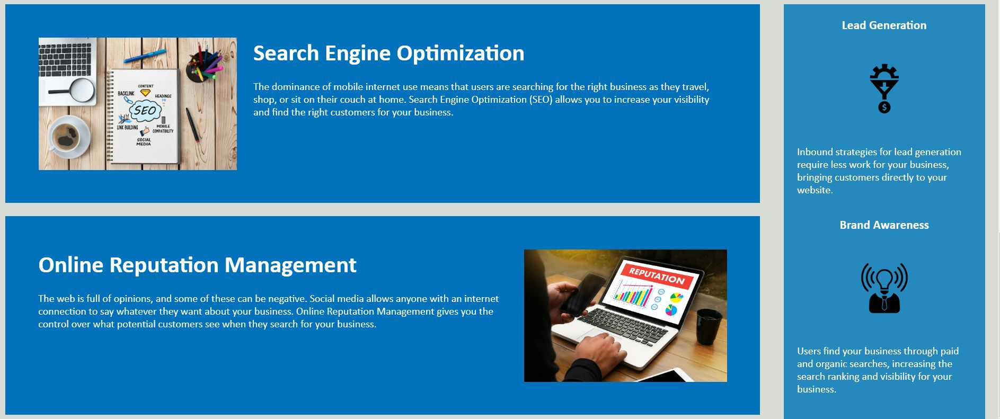
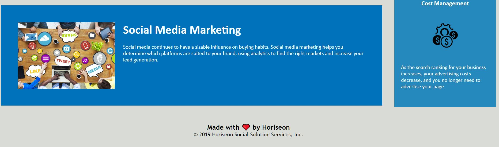

# Code Refactor Starter Code

## Description
### User Story
AS A marketing agency
I WANT a codebase that follows accessibility standards
SO THAT our own site is optimized for search engines

### Acceptance Criteria
GIVEN a webpage meets accessibility standards
WHEN I view the source code
THEN I find semantic HTML elements
WHEN I view the structure of the HTML elements
THEN I find that the elements follow a logical structure independent of styling and positioning
WHEN I view the image elements
THEN I find accessible alt attributes
WHEN I view the heading attributes
THEN they fall in sequential order
WHEN I view the title element
THEN I find a concise, descriptive title

## Credits
[NC State University - IT Accessibility](https://accessibility.oit.ncsu.edu/it-accessibility-at-nc-state/developers/accessibility-handbook/alternative-text/)  
[W3Schools](https://www.w3schools.com/)  
[GeeksForGeeks](https://www.geeksforgeeks.org/what-is-the-difference-between-section-and-div-tags-in-html/#)  

## License
MIT